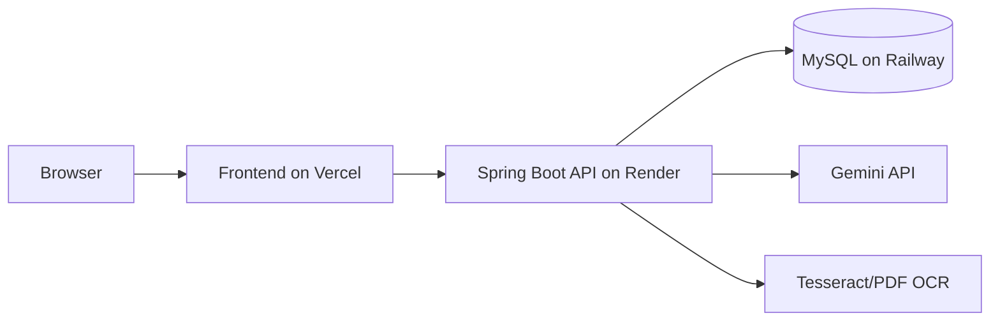

# FinanceFlow AI

FinanceFlow AI is a full-stack financial management system built with React, Vite, Tailwind, and Spring Boot.

## Features

- Role-based dashboards for Admin, Manager, and Accountant
- Expense creation, editing, approval, and reporting
- Receipt upload and OCR-ready processing flow
- AI assistant chat backed by finance data
- JWT authentication with refresh tokens
- Seeded demo users, departments, budgets, expenses, and audit trail

## Demo Credentials

- Admin: admin@financeflow.com / Admin@123
- Manager: manager@financeflow.com / Manager@123
- Accountant: accountant@financeflow.com / Accountant@123

## Backend

Path: `backend`

Environment variables:

- `PORT`
- `SPRING_DATASOURCE_URL`
- `SPRING_DATASOURCE_USERNAME`
- `SPRING_DATASOURCE_PASSWORD`
- `JWT_SECRET`
- `ACCESS_TOKEN_MINUTES`
- `REFRESH_TOKEN_DAYS`
- `CORS_ALLOWED_ORIGINS`

Run locally:

```bash
cd backend
mvn spring-boot:run
```

## Frontend

Path: `frontend`

Environment variables:

- `VITE_API_BASE_URL`

Run locally:

```bash
cd frontend
npm install
npm run dev
```

## Deployment

- Frontend: Vercel
- Backend: Render
- Database: Railway MySQL

See `deployment-guide.md` for deployment details.

## Architecture


